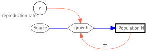

{height="30%" fig-align="center" fig-alt="System diagram of exponential growth."}

---

**Discrete Growth**

In discrete growth, cell division occurs at fixed time intervals.

The number of cells (the abundance $N$) at a future time $t+1$ is the abundance of cells at the current time $t$ plus the number of new cells added $b\cdot N_{t}$. 
Here, $b$ is the per-capita reproduction rate (birth rate), the proportion of cells that divide.

$$
N_{t+1} = N_{t} + b \cdot N_{t}
$$

The abundance $N$ is either dimensionless and means “number of individuals,” but it can also be specified with a unit of measurement,  e.g., individuals per square meter or per liter.
A concentration value is also possible, e.g., mg/L biomass or mg/L carbon.

Instead of the birth rate $b$, the symbol $r$ is often used, representing the net reproduction rate. 
This consists of two parts: the birth rate $b$ and the death rate $d$.
Depending on whether the difference $r=b-d$ is positive or negative, the population grows or declines.

A birth rate $r=1$ means that for every existing individual, a new individual is added per time step, resulting in a doubling of the population.

**Continuous Growth**

When considering a very large number of individuals that reproduce continuously—that is, not at fixed intervals—we refer to this as **exponential growth**. 
The equation above becomes an exponential function:

$$
N_t = N_0 \cdot e^{r \cdot t}
$$

This function describes the development of the number of individuals (abundance, $N$) at time $t$ as a function of the net reproduction rate $r$ and the initial abundance $N_0$ at time $t=0$.

For animals that reproduce only once a year, discrete growth models are typically used in practice, while continuous models are typically used for microorganisms.

**The System Diagram**

A so-called system diagram can be used for illustration purposes:

* In this diagram, a thick-bordered rectangle represents a state variable, e.g., the abundance of a population,
* thick arrows represent a flow of matter or energy, and 
* thin arrows represent an interaction.
* Metabolic processes, e.g., growth, are symbolized by a hexagon in this example, 
* while fixed parameters, metabolic rates, and auxiliary variables are represented by circles.

Positive (enhancing) feedback can be symbolized by a (+), and negative feedback by a (-).
