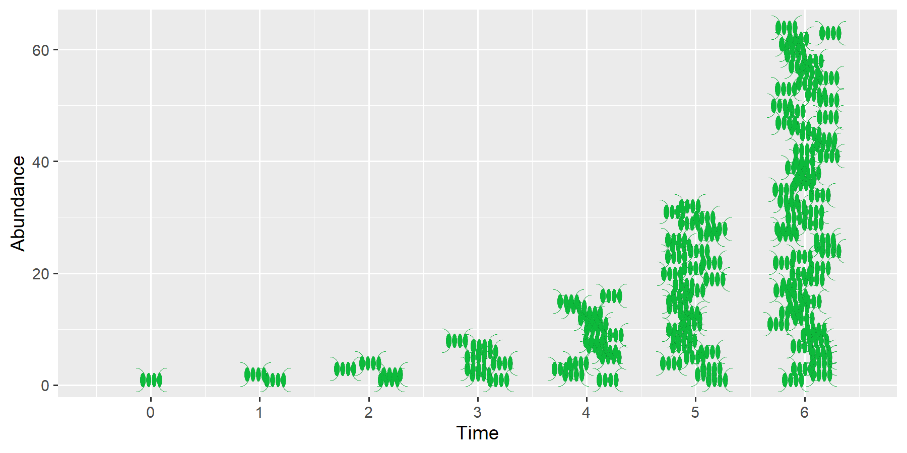

{fig-alt="The image shows a schematic representation of algae cells multiplying through division."}
---

**Population Growth by Doubling**

Single-celled organisms, such as bacteria or phytoplankton, can reproduce very quickly. The figure shows schematically how the number of phytoplankton cells doubles with each division. This results in a geometric sequence: 1-2-4-8-16-32-64, and so on.

To describe such a growth process, three basic pieces of information are needed:

1. The number of organisms present. This is called **abundance** and is usually denoted by the symbol $N$ (number).

2. The population growth per unit of time, in this case doubling.

3. The underlying time interval $\Delta t$ during which the growth occurs, e.g., a day, an hour, or a year.

**How fast does a population grow?**

1. The greater the existing abundance, the greater the increase. One cell becomes two; 8 cells become 16. 

2. The greater the increase, the faster the population grows. Instead of doubling (factor = 2, growth = 100%), the organisms could also increase tenfold (factor = 10, growth = 900%), but only a small portion may reproduce, e.g., growth = 10%, in which case the factor = 1.1.

3. The smaller the time step in which reproduction occurs, the faster the population growth.
