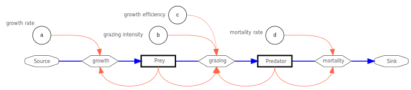

{height="20%" fig-align="center"  fig-alt="System diagram of the predator-prey model."}

---

**The Predator-Prey Model of Lotka and Volterra**

Unlike in logistic or resource-limited growth, stable equilibria are rarely observed in nature; instead, population abundance fluctuates. There are various reasons for this, such as the reproductive cycle or variations in food availability due to the seasons and weather.

However, population fluctuations can also result from interactions between populations.

Such interactions were investigated and mathematically described in the early 20th century by the Italian mathematician and physicist [Vito Volterra](https://de.wikipedia.org/wiki/Vito_Volterra) and the Austrian-American chemist and actuary [Alfred Lotka](https://de.wikipedia.org/wiki/Alfred_J._Lotka).

Their model consists of two equations, one for the prey population (e.g., algae) and one for the predator population (e.g., daphnia). As a modification to the notation of the equations originally used by @Volterra1926b, many scientists and textbooks use different symbols and variants. In the following, we use a simplified notation with $B$ for the prey population and $R$ for the predator population. For the model parameters, we use consecutive letters $a, b, c, d$, which can be interpreted as follows:

$a$: Reproduction rate of phytoplankton (prey population)

$b$: Loss of phytoplankton (prey) due to predation by daphnia (predators)

$c$: Growth efficiency of daphnia (predators) due to food intake

$d$: Mortality rate of daphnia (predators)

The model essentially consists of three processes. The growth of the prey population (e.g., algae) and the decline of the predator population (e.g., Daphnia) each correspond to an exponential growth model with a positive or negative rate of change, respectively.

Exponential growth of the prey population:

$$
\frac{dB}{dt} = a \cdot B\\
$$

Exponentielles Absterben der Räuberpopulation:

$$
\frac{dR}{dt} = - d \cdot R\\
$$

The third process describes the interaction between predators and prey. Here, the rate of decline in the prey population $(b \cdot R)$ depends on the abundance of the predator population, and the growth rate of the predator population depends on the abundance of the prey population $(c \cdot B)$. By choosing different values for $b$ and $c$, one can account for trophic efficiency ($c/b$), e.g., that only 10% of the food is used for reproduction.

This results in the following system of equations, in which, for clarity, the loss rate of the prey population due to predation and the growth rate of the predator population are denoted by additional parentheses:

**System of Equations**

$$
\begin{align}
\frac{dB}{dt} &= a \cdot B - (b \cdot R) \cdot B \\
\frac{dR}{dt} &= (c \cdot B) \cdot R - d \cdot R
\end{align}
$$

The parentheses are for illustrative purposes only and are usually omitted.
