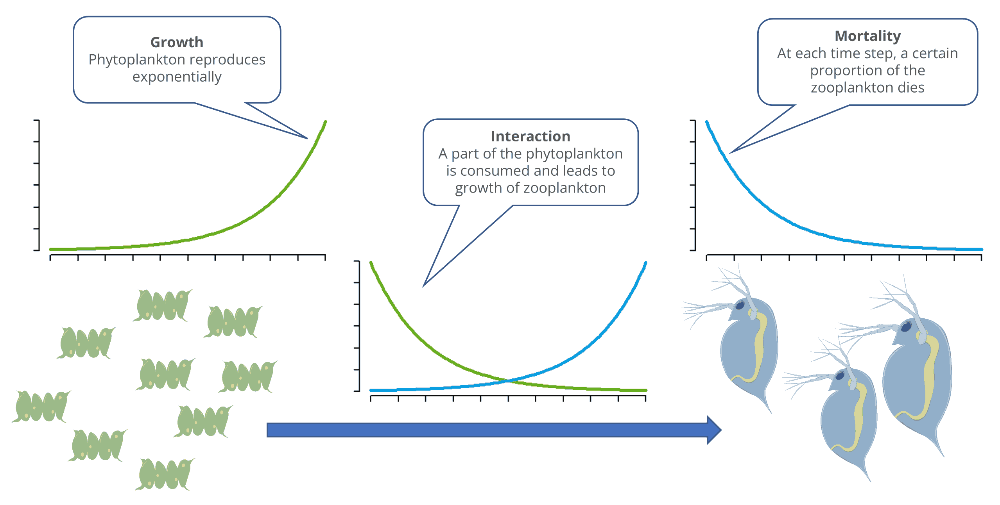

{fig-alt="The image shows how algae are eaten by daphnia. Without daphnia, the algae would grow exponentially. A portion of the daphnia die each time unit or are eaten by fish. The interaction between algae and daphnia reduces the algae population and allows the daphnia to reproduce.“ fig-height=”18%“ fig-align=”center"}
---

**Interaction Between Populations**

The models considered so far each describe only the growth of a single population.
In reality, multiple populations are almost always found together, either competing with one another or forming food chains and food webs.

In the following, we will examine a segment of a food chain involving a prey population and a predator population, e.g., phytoplankton (algae) and zooplankton (daphnia).