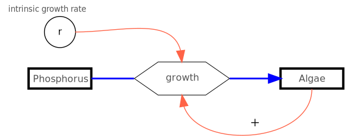

{height="30%" fig-align="center"  fig-alt="System diagramm of resource limited growth."}

---

**Phosphorus Limitation of Algal Growth**

In this example, we will describe the population growth of phytoplankton as a function of phosphorus ($P$ in mg m^-3). To avoid duplicate letters, we will refer to the phytoplankton as “algae” $A$. As a unit of measurement, we will use the biovolume or the carbon contained in the organisms in mg m^-3^. For time, we will use measurement hours (h).

$$
\begin{align}
\frac{dA}{dt} &= r(P) \cdot A \\
\frac{dP}{dt} &= - r(P) \cdot A \cdot \frac{1}{Y}\\
r(P) &= r_{max} \cdot \frac{P}{k_P + P}
\end{align}
$$

In more modern models, biomass is often expressed in units of carbon. Carbon is the “element of life” and accounts for approximately 50% of the dry weight in most organisms.

The first equation $dA/dt$ is, in principle, the exponential growth equation again; however, the growth rate $r$ is now a function of $P$, i.e., $r=f(P)$. When the nutrient $P$ is depleted,
the growth rate $r(P)$ approaches zero.

The first part of the phosphorus equation $dP/dt$ corresponds to the algae equation, but with a negative sign. 
When algae grow, phosphorus is consumed.
The conversion factor $1/Y$ is used to convert the phosphorus and carbon content of the algae stoichiometrically.
Here, one typically uses the reciprocal of the yield coefficient $Y$ (“Yield”).
A value of $Y=41$ means that for every 1 mg of phosphorus, 41 mg of carbon is bound in the biomass.

The function $r(P)$ describes the dependence of the growth rate $r$ on phosphorus as so-called saturation kinetics.
As the phosphorus concentration increases, the growth rate initially rises steeply.
When there is a nutrient surplus, the curve flattens out and approaches a maximum value $r_{max}$.
The value $k_P$ is the nutrient concentration at which 50% of the maximum growth rate is reached.
The smaller $k_P$ is, the better an algal species is adapted to low nutrient concentrations.

