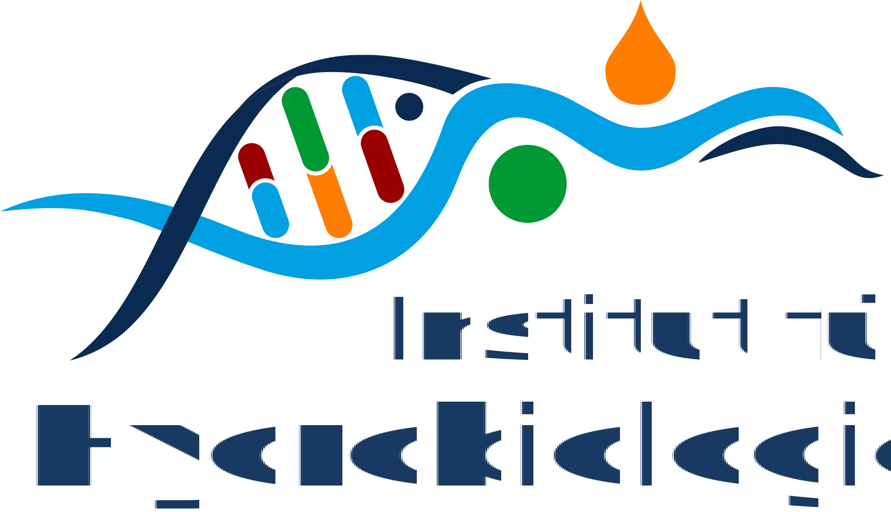

**Privacy policy**  

**Use of cookies**

We use only cookies that are absolutely necessary exclusively for the provision of the service. The cookies will be set automatically by access of this web page, except if setting cookies is disabled in the browser settings. Data processing takes place on the legal basis of section §6 para.1 lit. f GDPR.

* Name of the cookie: weblab.hydro.tu-dresden.de
* Cookie provider: TU Dresden
* Duration of storage: current browser-session, the cookie will be removed after closing the browser
* Purpose: enables the server to accept user input and to send the results back to the web browser

This means specifically that no so-called tracking cookies are used to record or analyse user movements and the surfing behaviour of users of our site.

**Impressum**

See the [Impressum of TU Dresden](https://tu-dresden.de/impressum) with following changes:

Contact person: 
Technische Universität Dresden 
Institut für Hydrobiologie 
Dr. Thomas Petzoldt 
01062 Dresden 
Tel.: +49 351 463-34954 
E-Mail: thomas.petzoldt@tu-dresden.de 

{height=44px fig-alt="Logo TU Dresden"}
{height=40px fig-alt="Logo Institut für Hydrobiologie"}

**Lizenz/License** 

Die App Ist eine "Offene Bildungsresource". 
Sie dürfen die App als Ganzes sowie einzelne Bausteine gemäß der [Creative Commons Lizenz CC BY-SA 4.0](https://creativecommons.org/licenses/by-sa/4.0/) frei verwenden (teilen, bearbeiten, Namensnennung, Weitergabe unter gleichen Bedingungen). Wenn Sie das Material remixen, verändern oder anderweitig direkt darauf aufbauen, dürfen Sie Ihre Beiträge nur unter derselben Lizenz wie das Original verbreiten. Es wird keine Gewähr für die inhaltliche Richtigkeit und technische Funktion übernommen.

The app is an "open educational resource". You may freely use (share, edit) the app as a whole as well as individual components in accordance with the [Creative Commons License CC BY-SA 4.0](https://creativecommons.org/licenses/by-sa/4.0/) as long as you attribute its authors. If you remix, transform, or build upon the material, you must distribute your contributions under the same license as the original. No guarantee is given for the correctness of content and technical function.

{height=40px fig-alt="Logo CC BY-SA"}
{height=40px fig-alt="Logo: Open Educational Resources"}

----
202-12-19, 2026-06-01

