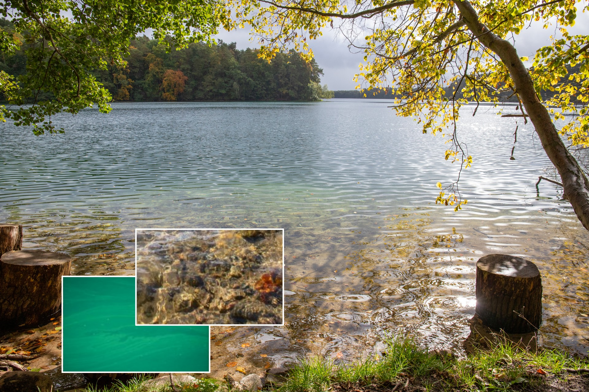
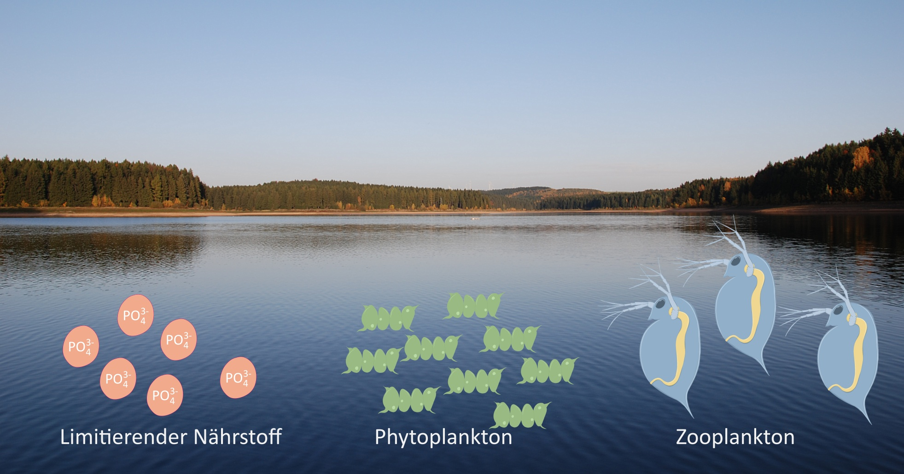

{title="Blick auf den Stechlinsee" fig-alt="Darstellung eines naturnahen Sees, dazu ein eingefügtes Symbolbild mit besonders klarem Wasser und ein Symboldbild mit starker Algenentwicklung" width="100%" fig-align="center"}
[Foto: Felix Grunicke]{.gray}

## Ein klarer oder ein trüber See?

Wenn wir vom Ufer in einen Badesee schauen, dann ist das Wasser
manchmal so klar, dass wir bis auf den Grund sehen können. Wenn wir genau hinschauen,
können wir vielleicht sogar Tiere erkennen, zum Beispiel Daphnien (Wasserflöhe).

Wer öfters am Ufer spazieren geht, kann beobachten dass der See
nicht immer klar ist. Manchmal ist er durch mikroskopisch kleine Algen (das Phytoplankton)
getrübt und grün gefärbt. Das Phytoplankton ist für die Nahrungskette sehr wichtig, 
denn es ernährt das Zooplankton und das wiederum die Fische. 
Andererseits können starke Phytoplanktonentwicklungen zu ernsthaften Problemen führen. 
Man darf dann nicht mehr im See baden. Bei der Trinkwassergewinnung aus Talsperren 
müssen die Algen im Wasserwerk entfernt werden.

## Ein Ausschnitt aus der Nahrungskette

{fig-alt="Teil einer Nahrungskette in einem See. Das Bild zeigt im Hintergrund einen Stillen See und im Vordergrund grafische Symbole für Phosphat (PO4 3-) als limitierenden Nährstoff, Phytoplankton und Daphnien" width="100%" fig-align="center"}
[Foto: tpetzoldt]{.gray}

Der Wechsel zwischen einem klaren und einem grünen, trüben Gewässer resultiert daraus, dass **Schwankungen der Populationsdichte** auftreten. Das kann sehr schnell gehen, weil Mikroalgen und Daphnien sehr schnell wachsen und sich vermehren. In der Natur hängt die Geschwindigkeit des Wachstums von vielen Faktoren ab, z.B. von der Jahreszeit, vom Wetter, vom Nährstoffangebot und vom Fischbestand.

Weltweit arbeiten viele Wissenschaftler daran, diese Prozesse besser zu verstehen und mathematisch zu beschreiben, um den Zustand der Gewässer zu verstehen und zum Beispiel eine Algenentwicklung vorhersagen zu können. Hierzu verwendet man mathematische Modelle und neuerdings auch künstliche Intelligenz. Außerdem muss man sehr viel messen.

## Modellierung von Wachstumsprozessen

Der genaue Zeitverlauf einer Algenentwicklung ist in der Realität nur schwer vorhersagbar, weil in einem See viele unterschiedliche Phyto- und Zooplanktonarten vorkommen und viele Umweltfaktoren gleichzeitig wirken. Trotzdem kann das Beispiel "Algenentwicklung in einem See" helfen, grundlegende Wachstumsprozesse zu verstehen. Wachstum ist überall in der Natur zu finden, bei Pflanzen, Insekten oder Wildtieren. Ähnliche Modelle werden auch für die Ausbreitung von Krankheiten angewendet, zum Beispiel während der Corona-Pandemie. 

In der App "Populationswachstum" wollen wir uns mit einigen grundlegenden Wachstumsprozessen befassen. Wir beginnen zunächst mit einem ungebremsten, exponentiellen Wachstumsmodell, befassen uns anschließend mit Formen des limitierten Wachstums und betrachten schließlich eine Räuber-Beute-Interaktion zwischen zwei Populationen.
