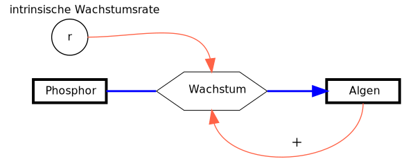

{height="30%" fig-align="center"  fig-alt="Systemdiagramm für das ressourcenlimitierte Wachstum."}

---

**Phosphorlimitation des Algenwachstums**

Im Beispiel soll das Populationswachstum des Phytoplanktons in Abhängigkeit vom Phosphor ($P$ in mg m^-3^) beschrieben werden. Zur Vermeidung doppelter Buchstaben nennen wir das Phytoplankton "Algen" $A$, als Maßeinheit verwenden wir das Biovolumen oder den in den Organismen enthaltenen Kohlenstoff in mg m^-3^. Für die Zeit wählen wir die Maßeinheit Stunden (h).

$$
\begin{align}
\frac{dA}{dt} &= r(P) \cdot A \\
\frac{dP}{dt} &= - r(P) \cdot A \cdot \frac{1}{Y}\\
r(P) &= r_{max} \cdot \frac{P}{k_P + P}
\end{align}
$$

In moderneren Modellen wird die Biomasse oft in Kohlenstoffeinheiten angegeben. Kohlenstoff ist das "Element des Lebens" und hat bei den meisten Organismen ungefähr 50% Anteil an der Trockenmasse.

Die erste Gleichung $dA/dt$ ist im Prinzip wieder die exponentielle Wachstumsgleichung, allerdings ist die Wachstumsrate $r$ jetzt eine Funktion von $P$, also $r=f(P)$. Wenn der Nährstoff $P$ aufgebraucht ist,
geht die Wachstumsrate $r(P)$ gegen Null.

Der erste Teil der Phosphorgleichung $dP/dt$ entspricht der Gleichung der Algen, allerdings mit negativem Vorzeichen. Wenn Algen wachsen, wird Phosphor verbraucht. Der Umrechnungsfaktor $1/Y$ dient dazu, den Phosphor und den Kohlenstoffanteil der Algen stöchiometrisch umzurechnen. Hier verwendet man üblicherweise den Kehrwert des Ertragskoeffizienten $Y$ ("Yield", engl. Ertrag). Ein Wert von $Y=41$ bedeutet, dass für 1 mg Phosphor 41 mg Kohlenstoff in der Biomasse gebunden werden.

Die Funktion $r(P)$ beschreibt die Abhängigkeit der Wachstumsrate $r$ vom Phosphor als sogenannte Sättigungskinetik. Bei steigender Phosphorkonzentration steigt die Wachstumsrate zunächst steil an. Bei Nährstoffüberschuss flacht die Kurve ab und nähert sich einem Maximalwert $r_{max}$ an. Der Wert $k_P$ ist die Nährstoffkonzentration bei der 50% der maximalen Wachstumsrate erreicht werden. Je kleiner $k_P$ ist, umso besser ist eine Algenart an niedrige Nährstoffkonzentrationen angepasst.

