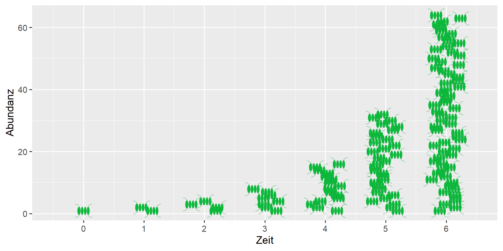

{fig-alt="Das Bild zeigt schematisch Algenzellen, die sich durch Teilung verdoppeln."}
---

**Populationswachstum durch Verdopplung**

Einzellige Organismen, zum Beispiel Bakterien oder Phytoplankton, können sich sehr schnell vermehren. Die Abbildung zeigt schematisch, wie sich die Anzahl der Phytoplanktonzellen bei einer Zweiteilung verdoppelt. Somit entsteht eine geometrische Folge: 1-2-4-8-16-32-64 und so weiter.

Zur Beschreibung eines solchen Wachstumsprozesses benötigt man drei grundlegende Informationen:

1. Die Anzahl der vorhandenen Organismen. Man nennt das die **Abundanz** und verwendet dafür üblicherweise das Symbol $N$ (number).

2. Das Populationswachstum pro Zeiteinheit, im vorliegenden Fall die Verdopplung.

3. Den zugrunde liegenden Zeitschritt $\Delta t$, in dem der Zuwachs stattfindet, z.B. ein Tag, eine Stunde oder ein Jahr.

**Wie schnell wächst eine Population?**

1. Der Zuwachs ist umso größer, je größer die bereits vorhandene Abundanz ist. Aus einer Zelle werden zwei, aus 8 Zellen werden 16. 

2. Je größer der Zuwachs ist, desto schneller erfolgt das Populationswachstum. Anstelle einer Verdopplung (Faktor = 2, Zuwachs = 100%), könnten sich die Organismen auch verzehnfachen (Faktor = 10, Zuwachs = 900%) aber es kann sich auch nur ein kleiner Teil vermehren, z.B. Zuwachs = 10%, dann ist der Faktor = 1,1.

3. Je kleiner der Zeitschritt ist, in dem die Vermehrung stattfindet, desto schneller wird das Populationswachstum.
