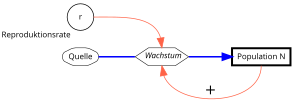

{height="30%" fig-align="center" fig-alt="Systemdiagramm für das exponentielle Wachstum."}

---

**Diskretes Wachstum**

Beim diskreten Wachstum erfolgt die Vermehrung in festen Zeitschritten.

Die Anzahl der Zellen (die Abundanz $N$) zu einem zukünftigen
Zeitpunkt $t+1$ ist die Abundanz der Zellen zum aktuellen
Zeitpunkt $t$ plus die Anzahl der neu hinzukommenden Zellen $b\cdot
N_{t}$. Hierbei ist $b$ die Pro-Kopf-Vermehrungsrate (englisch *birth
rate*), der Anteil der Zellen die sich teilen.

$$
N_{t+1} = N_{t} + b \cdot N_{t}
$$

Die Abundanz $N$ ist entweder dimensionslos und bedeutet "Anzahl Individuen", sie kann aber auch mit einer Bezugseinheit angegeben werden,  z.B. Individuen pro Quadratmeter oder pro Liter. Auch eine Konzentrationsangabe ist möglich, z.B. mg/L Biomasse oder mg/L Kohlenstoff.

Anstelle der Vermehrungsrate $b$ verwendet man oft das Symbol $r$, die Nettoreproduktionsrate. Diese setzt sich aus zwei Teilen zusammen, der Vermehrungsrate $b$ (engl. birth) und der Absterberate $d$ (engl. death). Je nachdem ob die Differenz $r=b-d$ positiv oder negativ ist, wächst die Population oder sie nimmt ab.

Eine Vermehrungsrate $r=1$ bedeutet, dass für jedes vorhandene Individuum pro Zeitschritt ein neues Individuum dazukommt, also eine Verdopplung.

**Kontinuierliches Wachstum**

Wenn man sehr viele Individuen betrachtet, die sich kontinuierlich vermehren, also nicht in festen Zeitschritten, spricht man vom **exponentiellen Wachstum**. Aus der Gleichung oben wird eine Exponentialfunktion:

$$
N_t = N_0 \cdot e^{r \cdot t}
$$

Die Funktion beschreibt die Entwicklung der Anzahl der Individuen (Abundanz, $N$) zum Zeitpunkt $t$ in Abhängigkeit von der Netto-Reproduktionsrate $r$ und der Anfangsabundanz $N_0$ zum Zeitpunkt $t=0$.

Bei Tieren, die sich nur einmal im Jahr fortpflanzen verwendet man in der Praxis meistens diskrete Wachstumsmodelle, bei Mikroorganismen meistens kontinuierliche Modelle.

**Das Systemdiagramm**

Zur Veranschaulichung kann man ein sogenanntes Systemdiagramm benutzen:

* Hierbei bedeutet ein dick umrandetes Rechteck eine Zustandsgröße, z.B. die Abundanz einer Population,
* dicke Pfeile stellen einen Stoff- oder Energiefluss dar und 
* dünne Pfeile eine Wechselwirkung.
* Umsatzprozesse, z.B. das Wachstum, sind im vorliegenden Diagramm als Sechseck symbolisiert, 
* Feste Parameter, Umsatzraten und Hilfsgrößen werden als Kreis dargestellt.

Eine positive (verstärkende) Rückkopplung kann mit einem (+) symbolisiert werden, eine negative Rückkopplung mit einem (-).
