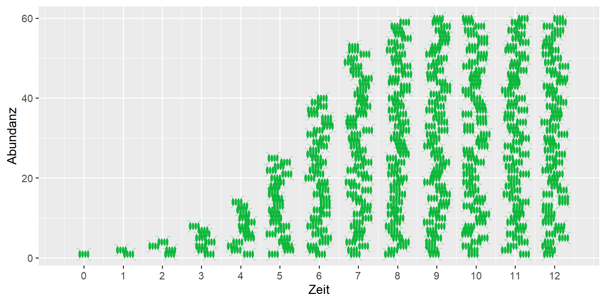

{fig-alt="das Bild zeigt schematisch Algenzellen, die sich durch Teilung verdoppeln, bis das Wachstum eine Grenze erreicht. Es ergibt sich eine S-förmige Kurve, die das begrenzte Wachstum symbolisiert."}
---

**Wachstum kann nicht unbegrenzt fortdauern**

Die Simulationen zum exponentiellen Wachstum zeigen deutlich, dass ein ungebremstes Wachstum schon nach kurzer Zeit zu einer unvorstellbar großen Abundanz führt. 

Nehmen wir an, wir haben einen einzelnen Wasserfloh mit einer Länge von 1.5 mm und einer Masse von 0.25 mg bei einer Populationswachstumsrate von $r=0.1$ pro Tag (d^-1^). Bei ungebremster Vermehrung hätten wir nach 6 Monaten bereits 80 Millionen Daphien mit einer Gesamtmasse von 20 kg. Nach 14 Monaten wäre die Müritz, der größte deutsche See mit einem Volumen von 737 Mio m^3^, komplett mit Daphien ausgefüllt, in gut 15 Monaten sogar der Bodensee.

<!---
Müritz:  0.74 km^3
Bodensee: 48 km^3
mg                      ->kg   -> t = m3   / Mio m3 / km3
0.25 * exp(0.1 * 468) / 1e6    / 1000      / 1e6    / 1000
--->

In der Realität verlangsamt sich das Populationswachstum mit steigender Abundanz, so dass sich eine S-förmige Wachstumskurve ergibt. Eines der einfachsten Modelle dafür ist das sogenannte "logistische Wachstum".

Das logistische Modell ist eine der wichtigsten Formeln in der Populationsökologie. Allerdings wird dabei nicht berücksichtigt, wodurch die Limitation stattfindet. 
Sie kann bei Daphnien durch Nahrungsknappheit oder Sauerstoffmangel hervorgerufen werden. Bei Algen kommt es zur Selbstbeschattung, weil sich die Algenzellen gegenseitig das Licht wegnehmen. 
Manche Mikroorganismen besitzen die Fähigkeit zur Selbstregulation. Sie können die Zelldichte an chemischen Ausscheidungen der anderen Zellen erkennen und teilen sich weniger oft, bevor Licht und Nährstoffe knapp werden.  
