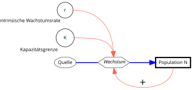

{height="30%" fig-align="center"  fig-alt="Systemdiagramm für das logistische Wachstum."}

---

**Das Wachstum verzögert sich**

Beim logistischen Wachstum ist die Wachstumsrate $r$ nicht mehr konstant, sondern eine Funktion der Abundanz:

$$
r = r_{max} \cdot \left(1 - \frac{N}{K}\right)
$$ 

Hierbei ergibt sich die eigentliche Wachstumsrate $r$ aus dem Produkt der artspezifischen (intrinsischen) Reproduktionsrate $r_{max}$ und einem dimensionslosen Term $\left(1 - \frac{N}{K}\right)$, wobei $r$ die realisierte Reproduktionsrate und $K$ die Kapazitätsgrenze (carrying capacity) ist.

Die Wachstumsgleichung dafür lautet jetzt:

$$
N_t = \frac{K N_0 e^{r t}}{K + N_0 (e^{r t}-1)}
$$

Das sieht relativ kompliziert aus, aber man kann gut damit rechnen. In Wirklichkeit ist diese Formel die Lösung einer Differentialgleichung:

$$
\begin{align}
\frac{dN}{dt} &= r_{max} \cdot \left(1 - \frac{N}{K}\right) \cdot N
\end{align}
$$
Diese beschreibt die Änderung der Population pro Zeiteinheit, genau so wie im Systemdiagramm.

**Erklärung**

Das Wachstum findet so lange statt, bis die **Umweltkapazität** $K$ erreicht ist. Bei geringer Populationsdichte, also wenn $N \ll K$ ist, dann ist der Term in Klammern annähernd gleich 1 und das Wachstum maximal. Das Produkt $r \cdot \left(1 - \frac{N}{K}\right)$ beträgt annähernd $r$.

Je mehr sich die Abundanz $N$ der Kapazitätsgrenze annähert, desto kleiner wird $r \cdot \left(1 - \frac{N}{K}\right)$ und konvergiert bei $N \rightarrow K$ gegen Null.
