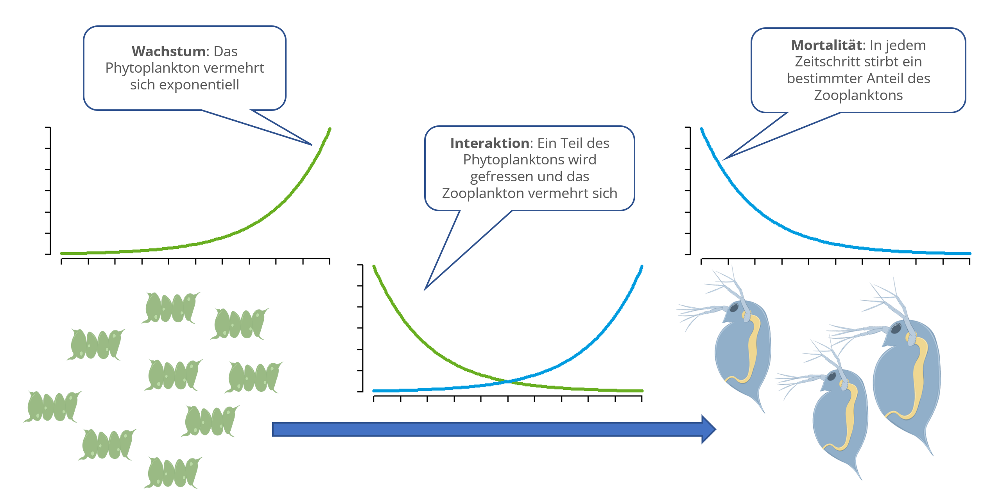

{fig-alt="Das Bild zeigt, wie Algen von Dahnien gefressen werden. Ohne Daphnien würden die Algen exponentiell wachsen. Von den Daphnien stirbt pro Zeiteinheit ein Teil oder wird durch Fische gefressen. Durch die Wechselwirkung zwischen Algen und Daphnien werden die Algen verringert und die Daphnien könne sich vermehren." fig-height="18%" fig-align="center"}
---

**Interaktion zwischen Populationen**

Die bisher betrachteten Modelle beschreiben jeweils nur das Wachstum einer einzelnen 
Population. In der Realität findet man fast immer mehrere Populationen 
gemeinsam, die entweder in Konkurrenz zueinander stehen oder Nahrungsketten und Nahrungsnetze bilden.

Im folgenden betrachten wir einen Ausschnitt aus einer Nahrungskette mit einer Beutepopulation und einer Räuberpopulation, z.B. Phytoplankton (Algen) und Zooplankton (Daphnien).
