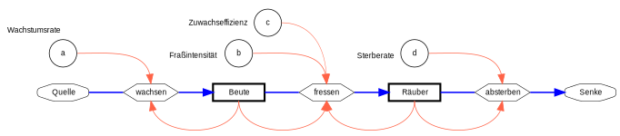

{height="20%" fig-align="center"  fig-alt="Systemdiagramm für ein Räuber-Beute-Modell."}

---

**Das Räuber-Beute-Modell von Lotka und Volterra**

Im Unterschied zum logistischen oder zum ressourcenlimitierten Wachstum lassen sich in der Natur nur selten stabile Gleichgewichte beobachten, sondern die Abundanz schwankt. Hierfür gibt es verschiedene Ursachen, z.B. den Vermehrungszyklus oder eine unterschiedliche Nahrungsverfügbarkeit durch die Jahreszeiten und das Wetter.

Populationsschwankungen können aber auch aus Wechselwirkungen zwischen Populationen resultieren.

Solche Wechselwirkungen wurden Anfang des 20. Jahrhunderts vom italienischen Mathematiker und Physiker [Vito Volterra](https://de.wikipedia.org/wiki/Vito_Volterra) und dem österreich-amerikanischen Chemiker und Versicherungsmathematiker [Alfred Lotka](https://de.wikipedia.org/wiki/Alfred_J._Lotka) untersucht und mathematisch beschrieben.

Ihr Modell besteht aus zwei Gleichungen, einer für die Beutepopulation (z.B. Algen) und einer für die Räuberpopulation (z.B. Daphnien). In Abwandlung zur von @Volterra1926b ursprünglich verwendeten Schreibweise der Gleichungen verwenden viele Wissenschaftler und Lehrbücher unterschiedliche Symbole und Varianten. Wir verwenden im folgenden eine vereinfachte Notation mit $B$ für die Beutepopulation und $R$ für die Räuberpopulation. Für die Modellparameter verwenden wir fortlaufende Buchstaben $a, b, c, d$, die man wie folgt interpretieren kann:

$a$: Vermehrungsrate des Phytoplanktons (Beutepopulation)

$b$: Fraßverlust des Phytoplanktons (Beute) durch Fraß der Daphnien (Räuber)

$c$: Zuwachseffizienz der Daphnien (Räuber) durch Nahrungsaufnahme

$d$: Sterberate der Daphnien (Räuber)

Das Modell besteht nun im Prinzip aus drei Prozessen. Das Wachstum der Beutepopulation (z.B. Algen) und das Absterben der Räuberpopulation (z.B. Daphnien) entsprechen jeweils einem exponentiellen Wachstumsmodell mit positiver bzw. negativer Änderungsrate.

Exponentielles Wachstum der Beutepopulation:

$$
\frac{dB}{dt} = a \cdot B\\
$$

Exponentielles Absterben der Räuberpopulation:

$$
\frac{dR}{dt} = - d \cdot R\\
$$

Der dritte Prozess beschreibt die Interaktion zwischen Räuber un Beute. Hierbei hängt die Verlustrate der Beutepopulation $(b \cdot R)$ von der Abundanz der Räuberpopulation ab und die Wachstumrate der Räuberpopulation von der Abundanz der Beutepopulation $(c  \cdot B)$. Wenn man $b$ und $c$ unterschiedlich wählt, kann man die trophische Effizienz ($c/b$) berücksichtigen, z.B. dass nur 10% der Nahrung für die Vermehrung genutzt werden.

Somit ergibt sich das folgende Gleichungssystem, bei dem zur besseren Erkennbarkeit die Verlustrate der Beutepopulation durch Gefressenwerden und die Wachstumsrate der Räuberpopulation durch zusätzliche Klammern symbolisiert sind:

**Gleichungssystem**

$$
\begin{align}
\frac{dB}{dt} &= a \cdot B - (b \cdot R) \cdot B \\
\frac{dR}{dt} &= (c \cdot B) \cdot R - d \cdot R
\end{align}
$$

Die Klammern dienen nur zur Veranschaulichung und werden normalerweise weggelassen.
