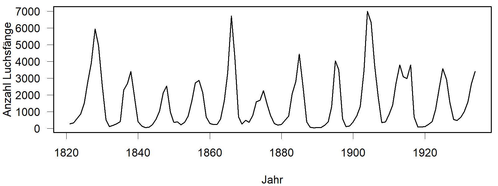

**Schneeschuhhasen und Luchse**

Im Zusammenhang mit dem Räuber-Beute-Modell wird oft das Beispiel von Schneeschuhhase und Luchs genannt. Die beiden Arten leben in Nordamerika, vor allem in Kanada.

Es konnte beobachtet werden, dass die Fellverkaufszahlen der Jäger in einem Zyklus von 9 bis 11 Jahren schwanken. Die Vermutung lag nahe, dass es sich hier um einen Lotka-Volterra-Zyklus handelt. Bei näherer Betrachtung zeigten sich allerdings Unstimmigkeiten und es wurden verschiedene andere Erklärungen gegeben. Eine Erklärung bestand darin, dass die schwankenden Fellverkäufe auf den Einfluss der Jäger zurückzuführen waren. Eine andere Erklärung besteht darin, dass der Räuber-Beute-Zyklus auf Wechselwirkungen einer niedrigeren trophischen Ebene resultiert, also nicht als Wechselwirkung zwischen Schneehaase und Luchs, sondern von Vegetation und den Schneehasen. Der Luchs folgt dem Zyklus lediglich nach. Näheres dazu findet man im Wikipedia-Artikel [Das Lotka-Volterra-Modell](https://de.wikipedia.org/wiki/R%C3%A4uber-Beute-Beziehung#Das_Lotka-Volterra-Modell).

{fig-alt="Zeitreihe von Luchsfängen in Kanada, aus Brockwell and Davis (1991)" width="100%" fig-align="center"}
[Klassischer Datensatz von Luchsfängen in Kanada, aus @Brockwell1991]{.gray}

**Algen und Daphnien**

Das System Algen-Daphnien wird in der theoretischen Ökologie ebenfalls als Lehrbuchbeispiel herangezogen.
In realen Gewässern lässt sich jedoch meist nur ein kurzer Ausschnitt dieser Dynamik beobachten.
Einem jährlichen Algen-Frühjahrsmaximum folgt unmittelbar ein ausgeprägtes Klarwasserstadium.
Eine Fortsetzung der Schwingungen wird durch dämpfende Mechanismen wie die Ressourcenlimitierung (insbesondere Phosphor) sowie die Einbindung in ein komplexeres Nahrungsnetz verhindert [@Sommer2012].

**Elche und Wölfe**

Ein weiteres prominentes Beispiel ist die Wechselbeziehung zwischen dem Elch und dem Wolf. Hierzu wurden im  [Isle Royale Nationalpark](https://de.wikipedia.org/wiki/Isle-Royale-Nationalpark) auf einer Insel in einem der Großen Seen in Amerika Untersuchungen durchgeführt. Es handelt sich um die längste Studie zu Räuber-Beute-Systemen der Welt.
Auf der Insel leben mit Ausnahme der Forschenden und der sommerlichen Besucher keine Menschen.
 

Zwischen den Elchen und den Wölfen konnten tatsächlich Wechselwirkungen vom Lotka-Volterra-Typ beobachtet werden. Allerdings gab es nur kurze Abschnitte eines Zyklus. In der Realität wirken auch hier zusätzliche Einflussfaktoren, z.B. Parasiten, die die Elche schwächen. Umgekehrt wurden die Wölfe zeitweilig von einer Viruskrankheit infiziert und wären fast ausgestorben.

In einem besonders kalten Winter wurden Wölfe beobachtet, die eine Strecke von 22km über den zugefrorenen See zur Insel zurückgelegt haben. Das bestätigte eine bereits länger bestehende Vermutung, dass die Wolfpopulation auf der Insel nicht vollständig isoliert ist. Der Austausch mit dem Festland ist für die Wolfpopulation offenbar überlebenswichtig, doch aufgrund der Klimaerwärmung bilden sich solche Eisbrücken nicht mehr alle 3 bis 4 Jahre, sondern nur noch alle 10 Jahre. 

Mehr dazu findet man auf den englischsprachigen Webseiten des Nationalparks und zum Forschungsprojekt ([https://isleroyalewolf.org/](https://isleroyalewolf.org/)) und im Buch von @Vucetich2024.
Auch auf Wikipedia finden sich Artikel in englischer und deutscher Sprache dazu. Ganz besonders zu empfehlen sind die Videos zum Projekt auf Youtube, z.B. [https://youtu.be/DS-4IsDg7mA](https://youtu.be/DS-4IsDg7mA). Weitere Videos in englischer Sprache findet man über die Stichworte: `wolves isle royale`.

**Schlussfolgerungen**

Die Beispiele zeigen, dass Räuber-Beute-Wechselwirkungen in der Praxis weitaus komplizierter sind als das Lotka-Volterra-Modell. Für Vorhersagen ist das Modell nicht geeignet aber man kann, so wie in den Simulationsexperimenten der App, grundlegende Erkenntnisse über das Entstehen von Populationsschwankungen oder die Einstellung von Gleichgewichten ableiten.

In praktischen Modellen werden unterschiedliche Modellbausteine kombiniert: exponentielles Wachstum, logistisches Wachstum, mehrere Ressourcen und Räuber-Beute-Wechselwirkungen. Außerdem werden in den Modellen aktuelle Daten zur Beschreibung von Wetter, Klima und menschlichem Einfluss berücksichtigt.

**Literatur**

Brockwell, P. J. and Davis, R. A. (1991). Time Series and Forecasting Methods. Second edition. Springer. Series G (p. 557).

Sommer, U., Adrian, R., De Senerpont Domis, L., Elser, J. J., Gaedke, U., Ibelings, B., Jeppesen, E., Lürling, M., Molinero, J. C., Mooij, W. M., van Donk, E., & Winder, M. (2012). Beyond the Plankton Ecology Group (PEG) Model: Mechanisms Driving Plankton Succession. Annual Review of Ecology, Evolution, and Systematics, 43, 429–448. [doi:10.1146/annurev-ecolsys-110411-160251](https://doi.org/10.1146/annurev-ecolsys-110411-160251)

Vucetich, J.A. (2021) Restoring the Balance: What Wolves Tell Us about Our Relationship with Nature. Johns Hopkins University Press.

