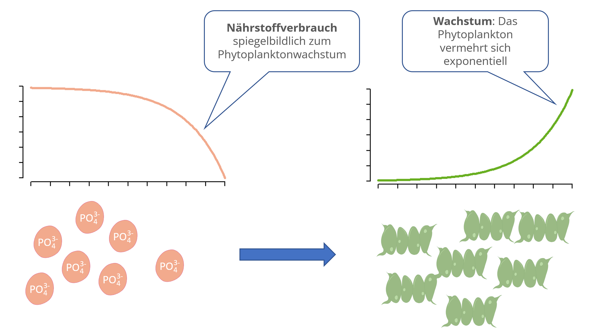

{fig-alt="Das Bild zeigt den zeitllichen Verlauf der Algenabundanz mit einer ansteigenden und die Nährstoffkonzentration mit einer abnehmenden S-förmigen Kurve." width="100%" fig-align="center"}
---

**Vom logistischen Wachstumsmodell zur Nährstofflimitation**

Das logistische Wachstumsmodell hat eine große theoretische Bedeutung und wird in der Praxis oft eingesetzt, z.B. für Wachstumsexperimente mit Bakterien und Algen im Labor oder für die biotechnologische Produktion von Medikamenten in der Industrie.

Allerdings hat das logistische Modell zwei entscheidende Nachteile: 

1. Man muss von vornherein wissen, wo die Kapazitätsgrenze $K$ liegt, z.B. aus einem vorangegangenen Experiment.

2. Es ist nicht bekannt, warum das Wachstum aufhört, ob z.B. ein Nährstoff aufgebraucht wurde oder ob sich die Algen gegenseitig zu stark beschatten.

Beim ressourcenlimitierten Wachstumsmodell wird dieses Problem dadurch gelöst, indem man für eine limitierende Ressource eine zusätzliche Gleichung angibt. Wenn das Phytoplankton wächst, wird eine Ressource verbraucht, z.B. der Phosphor. Wenn der Phosphor aufgebraucht ist, stoppt das Wachstum. Die Kurven von Phytoplankton und Phosphor zeigen ein spiegelbildliches Verhalten.

Anstelle des Phosphors kann auch der Stickstoff limitieren oder auch beide. Dann benötigt man eine weitere Gleichung (Mehrfachlimitation). Der Einfluss von Licht und Temperatur kann ebenfalls berücksichtigt werden.
