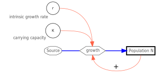

{height="30%" fig-align="center"  fig-alt="System diagramm of logistic growth."}

---

**Limits of Growth**

In logistic growth, the growth rate $r$ is no longer constant but is a function of abundance:

$$
r = r_{max} \cdot \left(1 - \frac{N}{K}\right)
$$ 

Here, the actual growth rate $r$ is given by the product of the species-specific (intrinsic) reproduction rate $r_{max}$ and a dimensionless term 
$\left(1 - \frac{N}{K}\right)$, where $r$ is the realized reproduction rate and $K$ is the carrying capacity.

The growth equation can then be written as:

$$
N_t = \frac{K N_0 e^{r t}}{K + N_0 (e^{r t}-1)}
$$

This looks quite complicated, but it is easy to calculate. In reality, this formula is the solution to a differential equation:

$$
\begin{align}
\frac{dN}{dt} &= r_{max} \cdot \left(1 - \frac{N}{K}\right) \cdot N
\end{align}
$$

This equation describes the change in population per unit of time, exactly as shown in the system diagram.

**Explanation**

Growth continues until the **carrying capacity** $K$ is reached. At low population density, i.e., when $N \ll K$, the term in parentheses is approximately equal to 1 and growth is at its maximum. The product $r \cdot \left(1 - \frac{N}{K}\right)$ is approximately $r$.

The closer the abundance $N$ approaches the carrying capacity, the smaller $r \cdot \left(1 - \frac{N}{K}\right)$ becomes, converging to zero as $N \rightarrow K$.
