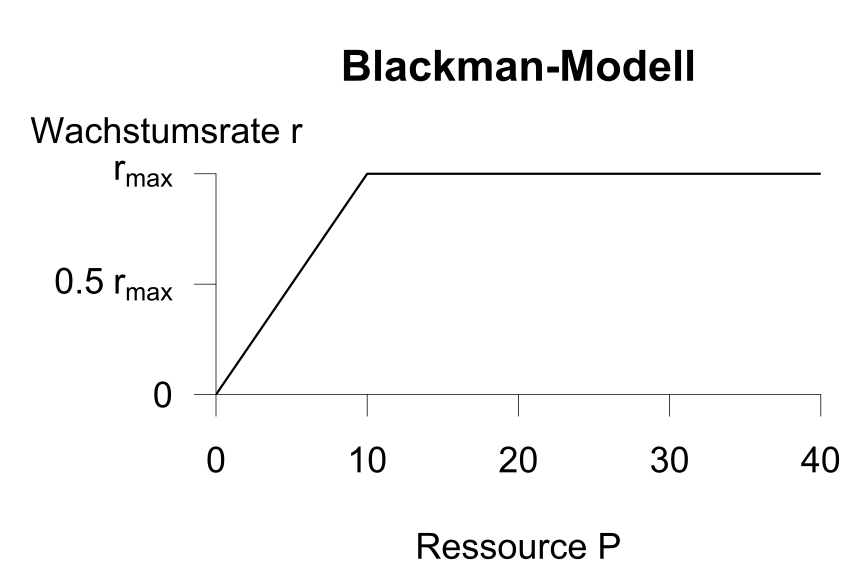
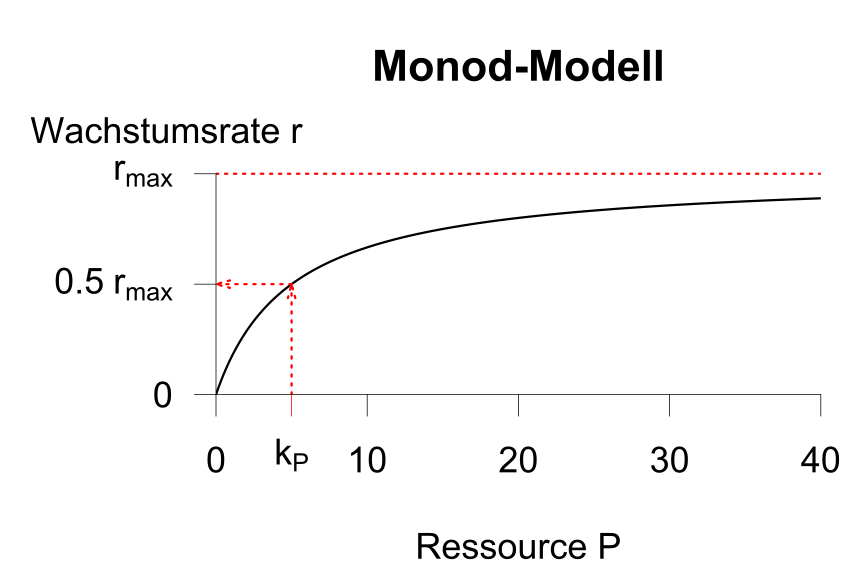

{width="49%" fig-alt="Graphical representation of the Blackman model."}
{width="49%" fig-alt="Graphical representation of the Monod model."}

**Growth Kinetics**

The relationship between the growth rate $r$ and the nutrient concentration
is described by what is known as **kinetics**. This refers to
how fast the algae grow; this is also called a
**functional response**. In contrast,
the actual growth models (e.g., the logistic
and resource-limited models) describe how many algae can grow
in total. This is called a **numerical response**.

For the dependence of the growth rate on a resource (e.g.,
phosphorus), saturation kinetics are used. The more nutrients
are available, the faster the growth. Above a certain
nutrient concentration, saturation is reached, meaning that even more
nutrients do not lead to further growth.

There are various ways to describe this mathematically.
In the **Blackman model**, the growth rate initially increases
proportionally with the nutrient concentration. Here, $k_b$ is the
proportionality factor. When the nutrient concentration ($P$) exceeds the
maximum possible growth rate ($r_{max}$),
the growth rate $r$ remains constant at $r_{max}$:

$$
r = r_{max} \cdot \min(k_b \cdot P, 1) 
$$
The **Monod model** assumes a gradual transition from the growth phase to
saturation. In the equation used for this purpose:

$$
r = r_{max} \cdot \frac{P}{k_P + P} 
$$ 

the limitation is achieved through a ratio in which the
denominator is a so-called half-saturation rate $k_P$, which has the same
unit of measurement as $P$. This makes this term dimensionless. If
the phosphorus concentration and the half-saturation rate are equal (i.e., $P=k_P$),
then the ratio $P/(P + P) = 0.5$. However, if $P$ is very large
($P >> k_P$), then the ratio converges to 1
and the growth rate $r$ converges to $r_{max}$.

Fast-growing phytoplankton species have a **high** maximum growth rate, 
while species that can survive on few nutrients have a **low**
semi-saturation constant.
