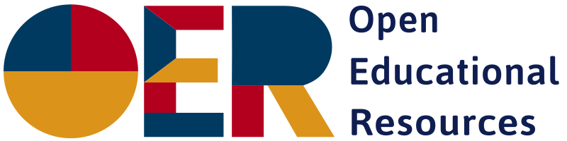
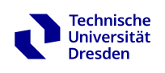

```{r setup, include=FALSE}
knitr::opts_chunk$set(echo = FALSE, fig.width=14, 
                      fig.height=6, dev.args = list(pointsize=20))
library("dplyr")
library("tidyr")
library("deSolve")
library("shiny")
library("plotly")
library("scales")
library("fontawesome")
library("shiny.i18n")

# 1. Map the central media/style folder
shiny::addResourcePath(prefix = "www", directoryPath = "../www")

# 2. Setup the translation engine for the shared R code and force English
#i18n <- Translator$new(translation_json_path = "../translation.json")
i18n <- Translator$new(translation_json_path = "../translation.json")
i18n$set_translation_language("en")

mypar <- list(las = 1, cex.lab = 1.4, cex.axis=1.4, lwd = 2)

figure_theme <- theme(
  axis.text = element_text(size=12),
  axis.title = element_text(size=12, face="bold"),
  legend.title = element_text(size=12, face="bold"),
  legend.text = element_text(size=12),
  strip.text = element_text(size=12, face="bold")
)
```


# Introduction


::: {.card width="20%" .gray}
**Simbiose-W, version 1.4-0**

The app is an open educational resource funded through the SimBiose project by the [Digital Teaching Fund](https://tu-dresden.de/zill/foerdermoeglichkeiten/fondsdll) at TU Dresden. 

You may freely use the app as a whole as well as individual components in accordance with the Creative Commons license [CC BY-SA 4.0](https://creativecommons.org/licenses/by/4.0/deed.de)  (share, edit, attribution, redistribute under the same terms). 
If you remix, modify, or otherwise build directly upon the material, you may distribute your contributions only under the same license as the original. 

No warranty is provided for the accuracy of the content or the technical functionality.

**Short link**

{width="6em" height="6em" fig-alt="QR Code auf diese Seite"}

[https://tud.link/q25ufy](https://tud.link/q25ufy)
<br>

:::{.smallfont}
**Quelltext für Entwickler**<br>
[https://gitlab.hrz.tu-chemnitz.de/simbiose/simbiose-w](https://gitlab.hrz.tu-chemnitz.de/simbiose/simbiose-w)
:::

::: {.card-footer}
{height=36px fig-alt="Logo CC BY-SA"}&nbsp;
{height=32px fig-alt="Logo: Open Educational Resources"}
:::
:::

::: {.card width="60%"}

:::

::: {.card width="20%" .gray}
**Usage Tips**

The app is optimized for display on laptop and PC monitors and on popular tablets.

If the text is still too large or too small, you can adjust the font size in your system settings or web browser:

* Windows: [Ctrl] + [-] or [Ctrl] + [+]
* Android/Chrome: Settings -- Accessibility
* iPad: if text overlaps, close all other tabs

Portrait mode is supported on smartphones.

**Development team at TU Dresden**

* [Chair of Limnology](https://tu-dresden.de/hydrobiologie) and 
* [Chair of Didactics of Biology](https://tu-dresden.de/mn/biologie/didaktik).


Thomas Petzoldt, Luisa Henze, Monique Meier


**Technologies**

[R](https://www.r-project.org), [Quarto](https://quarto.org), [Shiny](https://shiny.posit.co/), [deSolve](https://github.com/tpetzoldt/deSolve), [ggplot2](https://ggplot2.tidyverse.org/)

::: {.card-footer}
{height=44px fig-alt="Logo TU Dresden"}
{height=40px fig-alt="Logo Institut für Hydrobiologie"}
:::
:::


# Exponential Growth

## Description

::: {.panel-tabset width="38%"}

### Example



### The Model



### Tasks



### Hints



### Read More



:::

<!-- contains code with 2 columns --->



<!---------------------------------------------------------------------------/-->
# Limitierted Growth


## Description

::: {.panel-tabset width="38%"}


### example



### The Model



### Tasks



### Hints



### Read More



:::

<!-- contains code with 2 columns --->


<!---------------------------------------------------------------------------/-->
# Nutrient Limited Growth


## Description

::: {.panel-tabset width="38%"}


### Example



### The Model



### Tasks



### Hints



### Read More



:::

<!-- contains code with 2 columns --->


<!---------------------------------------------------------------------------/-->
# Predator-Prey Model


## Description

::: {.panel-tabset width="38%"}


### Example



### The Model



### Tasks



### Hints



### Read More



:::



<!---------------------------------------------------------------------------/-->
# Impressum



# &#9855; <!--- Wheelchair Symbol /--->



